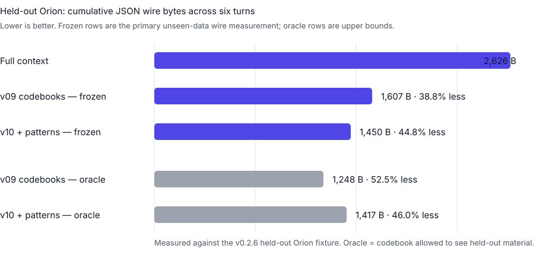

# Benchmark

SAGE benchmarks context reduction at three separate layers: **transport bytes**, **model-visible context**, and **downstream semantic/task retention**. The benchmark suite is designed to make those layers explicit so a smaller packet is never presented as a win when it loses required meaning.

!!! info "How to read these results"
    **Deterministic measured** results come from the local codec benchmark and can be reproduced without a model provider. **Frozen held-out** results measure unseen-data wire behavior with the codebook fixed before evaluation. **Oracle** rows are upper bounds and are labeled as such. Provider/model cost, latency, and task accuracy are published only when an external model adapter actually runs.

## Results at a glance

### Held-out Orion — unseen-data wire measurement

Orion is distinct from the RFC Phoenix fixture. Its codebook is established from shared context and then frozen before the held-out updates are revealed. Frozen rows therefore show what SAGE transmits when new wording, values, contradictions, and combinations appear after establishment.

| Variant | Codebook mode | JSON wire bytes | vs full context | Deterministic task score | Critical-fact recall | Status |
| --- | --- | ---: | ---: | ---: | ---: | --- |
| Full context (v01) | baseline | 2,626 | — | 1.00 | 1.00 | measured baseline |
| **SAGE codebooks (v09)** | **frozen** | **1,607** | **38.8% less** | — | — | **primary held-out wire result** |
| **SAGE + learned patterns (v10)** | **frozen** | **1,450** | **44.8% less** | — | — | **primary held-out wire result** |
| SAGE codebooks (v09) | oracle | 1,248 | 52.5% less | 0.99 | 1.00 | upper bound |
| SAGE + learned patterns (v10) | oracle | 1,417 | 46.0% less | 0.99 | 1.00 | upper bound |



The frozen rows are intentionally **not assigned deterministic task/fidelity scores in the codec-only artifact**. Their packet sizes and mechanisms are measured locally; downstream task accuracy for those frozen packets belongs to the sealed model-evaluation harness and requires a configured provider. The oracle rows retain the deterministic benchmark's task/fidelity fields and are useful only as an upper bound.

For v09, unseen novelty increases the payload from 1,248 bytes in oracle mode to 1,607 bytes frozen. The extra 359 bytes are the cost of falling back to literal representation when held-out concepts are not already in the frozen codebook. That fail-open behavior is intentional.

### Phoenix — deterministic codec regression benchmark

The RFC Phoenix fixture is a fixed six-turn conversation used to compare twelve strategies under identical conditions. The most useful SAGE rows are:

| Variant | JSON wire bytes | vs baseline | Model input tokens | Task success | Critical-fact recall | Setup | Break-even |
| --- | ---: | ---: | ---: | ---: | ---: | ---: | ---: |
| Full context (v01) | 2,027 | — | 509 | 1.00 | 1.00 | 0 B | — |
| **SAGE codebooks (v09)** | **1,172** | **42.2% less** | **296** | **1.00** | **1.00** | 675 B | 5 uses |
| SAGE + learned patterns (v10) | 1,341 | 33.8% less | 339 | 1.00 | 1.00 | 946 B | 9 uses |
| SAGE refs + state deltas (v11) | 2,068 | 2.0% more | 518 | 0.75 | 0.00 | 144 B | not within fixture |
| Full SAGE + ACKed knowledge (v12) | 3,503 | 72.8% more | 879 | 0.75 | 0.00 | 280 B | not within fixture |

The Phoenix headline is therefore deliberately narrow: **v09 reduces cumulative JSON wire payload by 42.2% and model-input tokens by 41.8% while retaining 1.00 task success and 1.00 across every benchmark fidelity category.** The 675-byte codebook establishment cost is reported separately and reaches break-even after five uses on this fixture.

The weaker v11/v12 rows are retained because the benchmark is a regression and mechanism test, not a marketing-only leaderboard. A strategy that is smaller or more sophisticated but loses required facts is not counted as a semantic win.

## What the current benchmark proves

- The real `SageCodec` can reduce repeated-context transport materially on the fixed Phoenix workload while preserving the benchmark's deterministic task and fidelity checks.
- Frozen codebooks still reduce wire payload on the unseen Orion split: 38.8% for v09 and 44.8% for v10 versus full-context transport.
- Unknown held-out meaning fails open to literals rather than being silently forced into an unsafe semantic code.
- Setup and amortization costs are visible; shared shorthand is not treated as free.
- Some mechanisms do not help on short fixtures, and those negative rows remain published.

## What is not yet claimed

The current local results do **not** establish that GPT, Claude, Gemini, or another external model preserves the same task accuracy on frozen Orion packets. They also do not provide real provider billing or end-to-end latency numbers. Those values require configured external model adapters and are reported as `not run, no provider` when unavailable.

The next evidence tier is a larger held-out corpus evaluated through at least two real model families with paired task scoring, token accounting, provider cost, latency, and confidence intervals.

## Benchmark design

### Compression levels

`scripts/compression_benchmark.py` separates:

- **Transport compression** — canonical JSON and MessagePack bytes actually transmitted.
- **Model-visible compression** — the representation the receiver model must consume.
- **Semantic compression** — task success, state reconstruction, and per-fact-type fidelity against the private answer key.

### Variants

Variants 1–8 are conventional serialization/context strategies; variants 9–12 run the real codec.

| Variant | Strategy |
| --- | --- |
| v01 | full natural-language context every turn |
| v02–v08 | latest-only, serialization, state, summary, and retrieval baselines |
| v09 | SAGE codebooks only |
| v10 | SAGE codebooks + learned patterns |
| v11 | SAGE references + state deltas |
| v12 | full SAGE with ACKed receiver knowledge |

The deterministic benchmark uses fixed timestamps, pinned packet ids, isolated scratch databases, and no RNG-dependent output.

### Sealed model boundary

With `--sealed`, an external model adapter receives only the task, compact model-facing packet, allowed decoder metadata, and identity/accounting fields. It does **not** receive source content, answer keys, change markers, receiver prior, or evaluator-only examples. Adapter-reported scores are ignored in sealed mode; the harness scores the returned task response against the private answer key.

The sealed direct-symbolic packet is rendered from the real codec packet and includes its atom codes/bindings, literals, references, base/delta information, provenance, and only wire-whitelisted metadata. The harness checks both wire-byte identity and round-trip reconstruction.

### Held-out split

`--held-out` requires `--sealed` and switches the harness to Orion. Establishment material is encoded first, then the SAGE codebook is frozen before held-out updates are revealed. SAGE variants are labeled explicitly as:

- `oracle_codebook: false` — frozen establishment-only codebook; the primary unseen-data measurement.
- `oracle_codebook: true` — codebook allowed to see all material; an upper bound, not the headline result.

### Warm receiver lifecycle

Warm rows are created through the real encode → deliver → decode/ACK → verify-knowledge lifecycle before follow-up encoding. If priming fails, the harness raises rather than emitting a fabricated warm benefit. On the current fixture, primed warm wire bytes equal cold wire bytes; the demonstrated value is lifecycle correctness and mechanism attribution, not a wire saving.

## Reproduce locally

Deterministic Phoenix benchmark, no provider required:

```bash
uv run --with '.[dev,mcp]' python scripts/compression_benchmark.py
uv run --with '.[dev,mcp]' python scripts/compression_benchmark.py --out /tmp/sage-benchmark
```

Sealed provider-backed evaluation:

```bash
SAGE_BENCH_LLM_PROVIDER=<provider> uv run --with '.[dev,mcp,bench,otel]' \
  python scripts/model_eval_harness.py --adapters adapters.json --sealed \
  --output /path/outside/repo
```

Sealed held-out Orion evaluation:

```bash
SAGE_BENCH_LLM_PROVIDER=<provider> uv run --with '.[dev,mcp,bench,otel]' \
  python scripts/model_eval_harness.py --adapters adapters.json --sealed \
  --held-out --output /path/outside/repo
```

## Measurement policy

Every published number must be either deterministic and locally reproducible or returned by a configured external runtime. Missing provider measurements stay missing. A smaller representation that changes required downstream behavior is a regression, not a compression win.

Next: [Protocol](Protocol.md)
